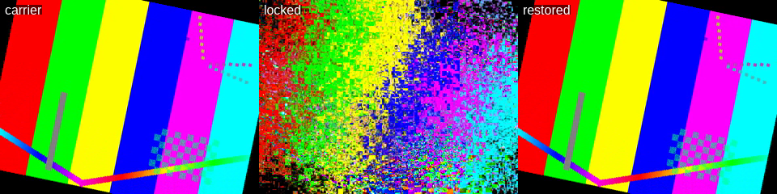

# glitchlock

Reversible, keyed bitstream scrambling for video, built on [FFglitch](https://ffglitch.org).

You take a video, scramble its guts with a key, and get back a file that still
plays — as a mess. Later, with the key and the manifest, you get the original
back **byte for byte**. Not "visually close". Identical SHA-256.



Left: the carrier. Middle: the same file after `glitchlock lock`, still a valid,
playable MPEG-2 stream. Right: after `glitchlock unlock` — pixel-identical to the
left, because the file is bit-identical to the left.

```console
$ glitchlock prepare holiday.mp4 -o carrier.mpg
$ glitchlock lock carrier.mpg -o locked.mpg -m manifest.json --key-file key.bin
  locking layer 1/2: mv
    576000/576000 slots across 240 frames
  locking layer 2/2: qscale
    7500/7500 slots across 250 frames
  self-test: pass (byte-exact)

$ glitchlock unlock locked.mpg -o restored.mpg -m manifest.json --key-file key.bin
integrity: OK - byte-exact match with the original carrier
```

## Why this works at all

Datamoshing is normally a one-way trip. You corrupt a bitstream, it looks great,
and the original is gone. glitchlock is reversible because it only ever writes
values the codec can store **exactly**, and it knows precisely which values those
are.

Motion vectors are the key. In MPEG-2 and MPEG-4, a decoded motion vector is
sign-extended to a fixed bit width derived from the frame's `f_code`. Write a
value outside that width and the decoder does not clamp it or reject it — it
*wraps* it, modulo the range. So each MV component lives in a genuine cyclic
group, ℤ↓N, where N is a power of two:

| codec | width | N at f_code=1 | domain |
|---|---|---|---|
| MPEG-1/2 video | `f_code + 4` | 32 | `[-16, 15]` |
| MPEG-4 / H.263 | `f_code + 5` | 64 | `[-32, 31]` |

In a B-frame the two directions have **different** f_codes: forward vectors are
coded against `fcode`, backward ones against `bcode`, which FFedit reports as a
separate field. On a `-bf 2` MPEG-2 encode, 27 of 32 B-frames had
`bcode != fcode`. Using the forward code for both is wrong in both directions —
too narrow and a legal file is refused, too wide and a value gets written that
the codec cannot store. Measured: writing `17` into a slot whose true `bcode`
is 1 read back as `-15`.

Any bijection on ℤ↓N is losslessly reversible. glitchlock uses two, both keyed:

- **Substitution** — add a keystream offset to each value, modulo its own domain.
- **Permutation** — shuffle values between slots, but only between slots with the
  *same* domain, so a value can never land somewhere too small to hold it.

MPEG-2's quantiser scale (`qscale`) is a second carrier: a fixed-width 5-bit
field with legal values 1–31, which behaves the same way.

That per-slot domain is not a guess. It is checked against every value in your
actual file before anything is written, and a violation aborts the lock rather
than silently wrapping a value into oblivion.

## What does *not* work, and why it is excluded

FFedit will happily let you edit DCT coefficients, and they make gorgeous
garbage. They are also not reversible, so glitchlock refuses them:

```
$ glitchlock inspect carrier.mpg
  q_dct          NOT reversible - DCT coefficients are variable-length coded; edits desynchronise the slice
  q_dc           NOT reversible - DC coefficients are differentially coded; edits desynchronise the slice
  mv             reversible - glitchlock can use this
  qscale         reversible - glitchlock can use this
```

DC and AC coefficients are variable-length coded, so changing a value changes how
many bits it occupies, which shifts everything after it. Measured directly: after
writing scrambled DC values and re-exporting, the *block structure itself* came
back different — the decoder reported `ac-tex damaged`, `invalid cbp` and
`slice mismatch`. There is no manifest that can undo that, so the feature is not
offered. See [DESIGN.md](DESIGN.md) for the full evidence.

## Install

You need FFglitch's binaries (`ffedit`, `ffgac`) on your `PATH`. Grab them from
<https://ffglitch.org/download/> — no build required.

```console
$ pip install git+https://github.com/armeehn/glitchlock
$ glitchlock inspect some.mpg
```

If FFglitch lives somewhere unusual, point at it with
`GLITCHLOCK_FFGLITCH_HOME=/opt/ffglitch`.

## Usage

### prepare — make a lockable carrier

Most video is H.264/HEVC, which exposes nothing reversible. `prepare` transcodes
to a glitchable MPEG-2 or MPEG-4 elementary stream using the standard FFglitch
encoder recipe (`+nopimb+forcemv`, so every macroblock carries a real vector).

```console
$ glitchlock prepare input.mkv -o carrier.mpg --codec mpeg2video --qscale 6 --gop 25
```

This step is lossy and drops audio — it is a transcode. **The carrier is the
plaintext.** Everything after this point is bit-exact.

### lock

```console
$ glitchlock lock carrier.mpg -o locked.mpg -m manifest.json --key-file key.bin
```

| flag | effect |
|---|---|
| `--features mv,qscale` | which carriers to use (default: all verified ones present) |
| `--mode full` | `full` (substitute + permute), `substitute`, or `permute` |
| `--intensity 0.3` | scramble only a key-selected 30% of slots — a dial, not a weakening of reversibility |
| `--keyless` | store the seed in the manifest; the manifest alone can unwind it |
| `--password` / `--key-file` | key material; scrypt is used for passphrases |
| `--no-selftest` | skip the reversibility proof (not recommended) |

`--mode permute` is worth knowing about: it moves vectors around without changing
their values, so the frame keeps its exact motion histogram and the result looks
like the scene tearing itself apart rather than dissolving into noise.

### unlock

```console
$ glitchlock unlock locked.mpg -o restored.mpg -m manifest.json --key-file key.bin
```

Exits non-zero if the restored file does not match the carrier digest recorded in
the manifest, so it is safe to use in a script.

### verify

Lock and unlock a file in a scratch directory and report whether the round trip
was exact. Useful for checking a new codec or a new FFglitch release.

```console
$ glitchlock verify carrier.mpg
round trip:  EXACT
```

## Public-key recipients

Lock a file for someone who has published a public key, with no shared secret:

```console
$ glitchlock keygen -o me.key
identity:    me.key  (mode 0600 - keep it secret)
public key:  glk-pub-v1:FAekY8ufscY1elddqOgee7hUPBxCcuPq3TnrCSt1Bko=
fingerprint: ba688596449807df

$ glitchlock lock carrier.mpg -o locked.mpg -m manifest.json \
      --recipient glk-pub-v1:FAekY8ufscY1elddqOgee7hUPBxCcuPq3TnrCSt1Bko=
recipients: 1 (ba688596449807df)

$ glitchlock unlock locked.mpg -o restored.mpg -m manifest.json --identity me.key
integrity: OK - byte-exact match with the original carrier
```

The asymmetric key never touches the video. This is ordinary hybrid encryption:
a random 32-byte content key drives the scrambler, and that content key is
sealed to each recipient with X25519 → HKDF-SHA256 → ChaCha20-Poly1305. The
manifest carries the sealed copies and nothing else; opening one needs the
matching private key. Repeat `--recipient` to lock for several people at once.

Needs the `cryptography` package — `pip install 'glitchlock[recipients]'`. The
core scrambler stays dependency-free.

**This solves key distribution, not information leakage.** The locked video is
still a playable video whose residual picture survives. Public keys make it
practical to hand a locked file to someone; they do not make the ciphertext
safe to publish. [SECURITY.md](SECURITY.md) is explicit about this.

## Streaming

Yes, it works on a stream, at GOP granularity, and the round trip stays
byte-exact. Encode with closed GOPs, split on sequence headers, and give every
segment its own number:

```console
$ glitchlock prepare live.mkv -o carrier.mpg --gop 12 --closed-gop
$ glitchlock lock seg_0007.mpg -o locked_0007.mpg -m /dev/null --segment 7 --key-file key.bin
```

The segment number matters more than it looks: without it, every segment's frame
0 derives an identical plan from the same key and nonce, and the whole broadcast
shares one keystream. The round trip still works, which is what makes it
dangerous.

The receiver finds segment boundaries by scanning the locked stream itself, and
can synthesise its manifest from session parameters — so nothing has to be sent
alongside the video. Latency is one GOP (480 ms at GOP 12/25 fps). 720p keeps up
with a live feed on 4 cores; 1080p needs more.

See [STREAMING.md](STREAMING.md) for the measurements and for what is still
missing — there is no TS/HLS wrapping, no audio path and no daemon yet.

## The manifest

The manifest is the record of how the file was scrambled. It is small — 1,085
bytes for a 3.1 MB video — because it stores *parameters*, not data:

```json
{
  "format": "glitchlock-manifest",
  "codec": "mpeg2video",
  "nonce": "273783ef4fc8ba9522477d549346e880",
  "carrier_sha256": "8d5aacc6...",
  "locked_sha256": "11101a6d...",
  "layers": [
    { "feature": "mv", "mode": "full", "intensity": 1.0,
      "frames": 240, "slots_total": 576000, "slots_touched": 576000,
      "repairs": {} }
  ],
  "selftest": "pass",
  "mac": "b08623b5..."
}
```

It never contains the key. It is authenticated with HMAC-SHA256 under your key,
so a wrong passphrase or an edited manifest is refused up front instead of
quietly producing rubbish.

`repairs` is the honesty valve. After locking, glitchlock reads its own output
back and compares it against what it intended to write. Anything the encoder did
not reproduce exactly is recorded here as a literal original value, so recovery
stays exact regardless. On `mv` and `qscale` this list comes back empty — which
is the expected result, and is asserted by the test suite rather than assumed.

## Self-test

By default `lock` unlocks its own output in a temp directory and compares the
digest to the input before it writes the manifest. If it does not match, **no
manifest is written and the command fails**. A lock that cannot be proven
reversible is not shipped.

Reversibility is not the only thing worth proving, though. A byte-identical
copy of the carrier unlocks to itself perfectly, so the self-test alone will
wave it through. `lock` therefore also refuses to write output that is
byte-identical to its input, because that output *is* the plaintext:

```console
$ glitchlock lock all-intra.m4v -o locked.m4v -m m.json --key-file key.bin
glitchlock: the locked file is byte-identical to the carrier: nothing was
actually scrambled, so this output is the plaintext. ...
```

Three ordinary things land here, and none of them used to say a word:

- **an all-intra carrier** (`--gop 1`) has no motion vectors to scramble;
- **a static shot with `--mode permute`** — every vector is `(0,0)`, and
  permuting values that are all equal is the identity map. Measured on a
  solid-grey clip: 29,550 slots reported scrambled, output identical;
- **a very low `--intensity` on a small file** can select zero slots.

Pass `--allow-noop` if you genuinely want a copy.

## Known limitations

- **Interlaced carriers do not work.** An interlaced MPEG-2 carrier
  (`-flags +ilme+ildct`) fails with a geometry error on every nonce; an
  interlaced MPEG-4 one fails on *some* nonces — measured 5 failures in 12.
  Field pictures split motion vectors per field and the re-exported slot
  layout does not match what was written. Deinterlace before `prepare`.
- **`verify` results are per-nonce.** Because of the above, a single passing
  run is weak evidence for a carrier *class*. `verify` now derives its nonce
  from the run index so a result is reproducible, and `--repeat N` sweeps N of
  them:

  ```console
  $ glitchlock verify interlaced.m4v --repeat 12
  ...
  result:     EXACT=7, FAILED=5
  this carrier is NOT reliably lockable: the outcome depends on the nonce,
  so one passing run proves nothing
  ```

- **FFglitch 0.10.2 aborts on some B-heavy MPEG-2 files.** `ffedit -f qscale`
  on a `-bf 4` carrier dies with `free(): chunks in smallbin corrupted`
  (exit 134) before glitchlock sees any data. It is an upstream crash, not a
  glitchlock one, and it fails closed — but it means such files cannot be
  locked with the `qscale` layer. `--features mv` still works on them.

## Status

Verified on FFglitch 0.10.2, MPEG-2 and MPEG-4 part 2. 117 tests pass,
including byte-exact round trips through real bitstreams for every mode, both
codecs, B-frames, 4MV, qpel and a chunked stream. Beyond the suite, a
900-configuration sweep across 18 source clips (odd dimensions, 16x16, single
frame, 60 fps, greyscale, pure noise, 720p) round-tripped byte-exact in every
case that scrambled anything at all.

**Only mpeg1video, mpeg2video and mpeg4 are actually lockable.** The domain
table also lists H.263, MSMPEG-4 v1–v3, WMV1/2 and FLV1 because their motion
vector geometry is known, but FFglitch 0.10.2 exposes no editable features for
any of them — `ffedit -i` lists nothing, so there is nothing to scramble. They
are kept in the table against a future FFglitch that does expose them.

## Is this encryption?

It is a keyed, reversible cipher, and the key really is required. It is **not**
a replacement for encrypting a file, and you should read
[SECURITY.md](SECURITY.md) before treating it as one. The short version: the
ciphertext is a video, and a video that still decodes leaks information about
itself. Use it for reversible glitch art, for obfuscation, for watermarking
experiments — not for protecting a secret. If you want confidentiality, use age
or GPG.

## License

MIT — see [LICENSE](LICENSE). FFglitch itself is GPL and is used here as an
external binary, not linked.
